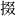
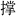
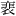
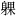
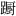
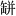

 訕 

 僧 

 駞 

 苽 

 氐 

 歘 

 拽 

 麤 

 嚧 

 獃 

 媿 

 氎 

 䗫 

 哆 

 裩 

 悱 

 嘳 

 𢖺 

 甑 

 鬔 

 啒 

 跰 

 拄 

 龍 

 錄 

 塼 

 猒 

 諸 

 菪 

 伇 

 嬭 

 刁 

 殽 

 氄 

 臊 

 咦 

 餓 

 㤆 

 情 

 琊 

 䄌 

 儞 

 絻 

 瞖 

 㜈 

 扭 

 嘮 

 顒 

 飯 

 剜 

 嶸 

 舡 

 牕 

 閦 

 頇 

 稅 

 瘵 

 﨟 

 蹬 

 窣 

 缼 

 虛 

 [顟] 

 虛 

 [輾] 

 兕 

 搽 

 𦡬 

 幞 

 埿 

 筠 

 斵 

 祖 

 琛 

 纍 

 邈 

 芊 

 㨮 

 珉 

 踢 

 毱 

 壒 

 掇 

 䚄 

 頼 

 攔 

 裒 

 燸 

 挲 

 坼 

 欤 

 洹 

 趦 

 捨 

 趯 

 攙 

 韛 

 敎 

 酤 

 跉 

 臏 

 彴 

 麻 

 迤 

 鎁 

 緗 

 筯 

 縑 

 恡 

 [拌] 

 羼 

 邛 

 洎 

 聻 

 埵 

 鉆 

 忉 

 潙 

 霶 

 趕 

 灃 

 淸 

 煞 

 [畢] 

 籙 

 嘈 

 珏 

 焰 

 樁 

 瘥 

 趄 

 顢 

 㝵 

 繒 

 泐 

 僧 

 琰 

 訒 

 拕 

 鞔 

 礱 

 䉬 

 絓 

 珵 

 煆 

 欞 

 卽 

 㬠 

 獦 

 蓏 

 精 

 憍 

 玷 

 益 

 齅 

 聃 

 縕 

 蕖 

 籮 

 飈 

 懞 

 廕 

 諸 

 媧 

 璿 

 趍 

 陡 

 鵾 

 誵 

 皤 

 鄕 

 牓 

 膖 

 閩 

 蠛 

 鏁 

 瑫 

 罣 

 輶 

 糍 

 瘖 

 俙 

 顇 

 犍 

 訾 

 隄 

 藭 

 圝 

 祖 

 諗 

 曬 

 堦 

 崆 

 祇 

 唵 

 虀 

 騃 

 呿 

 瘂 

 你 

 壍 

 莂 

 夤 

 挃 

 靑 

 䭔 

 跎 

 莾 

 袟 

 踧 

 烘 

 翎 

 謼 

 鼒 

 㲯 

 撑 

 檯 

 嬈 

 裵 

 𡎺 

 悅 

 塼 

 神 

 匾 

 增 

 懡 

 熅 

 獼 

 厙 

 螃 

 眨 

 戽 

 覰 

 狌 

 垜 

 撿 

 斅 

 𥶡 

 儞 

 鞲 

 瑘 

 瞌 

 蠲 

 揬 

 輭 

 爇 

 福 

 躶 

 吒 

 蒺 

 德 

 雞 

 徧 

 靸 

 噇 

 閒 

 漚 

 峒 

 請 

 鋌 

 脫 

 雘 

 鏌 

 𨍏 

 神 

 龐 

 摝 

 蹰 

 鞚 

 罣 

 飡 

 淩 

 篙 

 卽 

 鈸 

 情 

 苾 

 櫳 

 鶖 

 漭 

 颺 

 蹋 

 毿 

 濼 

 喏 

 輥 

 槵 

 嚬 

 㹀 

 睺 

 屙 

 埦 

 揲 

 既 

 椸 

 閫 

 飰 

 𨁝 

 拄 

 𣽅 

 䋺 

 窠 

 吧 

 㖒 

 牸 

 藿 

 緣 

 蟬 

 術 

 攞 

 䖝 

 拖 

 悞 

 繁 

 習 

 篾 

 磕 

 鱍 

 閴 

 邙 

 翻 

 𩝐 

 蔾 

 飽 

 邐 

 磷 

 蹭 

 㘅 

 𩕳 

 迊 

 德 

 缾 

 牯 

 纇 

 㦬 

 橛 

 迦 

 棙 

 囉 

 罤 

 螗 

 楖 

 觶 

 猻 

 葈 

 寬 

 縈 

 㞘 

 撐 

 玼 

 𣗖 

 攛 

 逭 

 剗 

 蠓 

 𨨄 

 漪 

 唼 

 獹 

 猢 

 懵 

 圊 

 璨 

 嗢 

 憨 

 憒 

 𢱢 

 說 

 啐 

 薝 

 敎 

 眴 

 徧 

 𨵩 

 庾 

 憎 

 㘞 

 餻 

 䙡 

 榸 

 巢 

 說 

 筭 

 捋 

 蘄 

